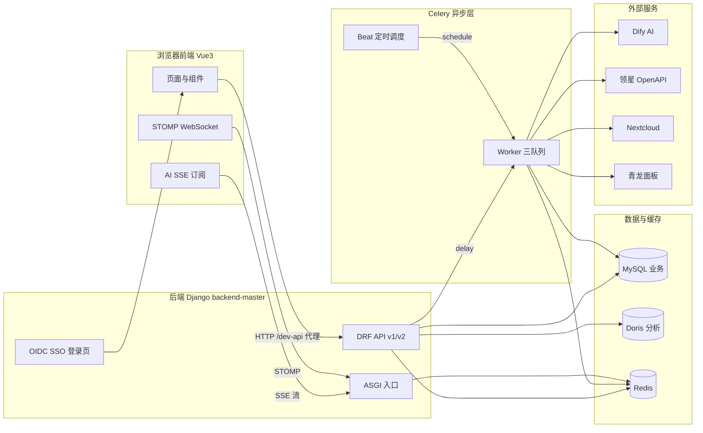

# 系统总览

本系统是一套面向**亚马逊电商运营团队**的 ERP 管理平台，深度整合领星（LingXing）广告与销售数据、Nextcloud 文件与单点登录、Dify AI 助手、青龙面板与数据爬虫。前端为单页应用，后端为前后端分离的 REST API。

## 业务定位

系统服务跨境电商运营的日常作业，核心能力包括：

- **销售管理**：商品 Listing 列表、批量打标签与分类、商品图片上传与同步。
- **广告管理**：亚马逊 SP 广告活动、广告组、投放、关键词、否定词、自动定向的全维度数据查看与创建提交；广告规则策略与分时调价工具；竞价与活动调整、优化策略匹配与执行。
- **AI 助手**：基于 Dify 的流式对话助手，支持思考模式（R1 深度推理 / V3 秒级快答）、Plan Mode 结构化方案卡片、会话与分组管理、全文搜索、导出 Markdown、快捷键。
- **统计报表**：基于领星 OpenAPI 的亏损订单报表（月度全部 / 前 20 天），支持同步触发与缓存读取。
- **系统管理**：用户、部门、岗位（承载菜单权限）、菜单动态路由、字典、参数配置、操作与访问日志、通知公告、Nextcloud 文件夹树。
- **数据采集**：爬取类目、采集节点配置、卖家精灵账号、爬虫日志。
- **开发者应用**：OAuth2 Client Credentials 应用的管理与密钥轮换。
- **工作汇报**：个人与团队工作汇报统计。
- **首页仪表盘**：库存概览、实时广告、实时销售、补货推荐、评论统计、结算利润、店铺绩效、天气实况。

## 技术栈

| 层 | 技术 |
| --- | --- |
| 后端框架 | Django 5.1 + Django REST Framework |
| 异步任务 | Celery + Redis（Broker 与结果后端） |
| 业务数据库 | MySQL（`default`） |
| 分析数据库 | Apache Doris（`analytics`，只读分析） |
| 缓存 | Redis（django-redis） |
| 认证 | 自定义 Bearer Token（DRF）+ OAuth2/OIDC Provider（django-oauth-toolkit） |
| AI 平台 | Dify（流式对话 `/v1/chat-messages`） |
| 前端框架 | Vue 3 + TypeScript + Vite |
| UI 库 | Element Plus + UnoCSS |
| 状态管理 | Pinia |
| 包管理 | pnpm（强制，`preinstall` 拦截 npm/yarn） |
| 实时通信 | STOMP over WebSocket（字典同步、在线人数） |

## 整体架构

## 仓库结构

单仓双应用，技术栈独立、互不依赖构建：

- `backend-master/` — Django 后端，入口 `backend_master/`（`settings.py` / `urls.py` / `celery.py`）。
- `vue3-element-admin-master/` — Vue3 前端，入口 `src/main.ts`。
- `docs/knowledge-base/` — 本知识库。
- `CLAUDE.md` — 项目工程规范总纲（随仓库分发，会话自动加载）。
- `AGENTS.md` — OpenCode 会话执行备忘。

## API 入口

后端对外入口（见 `backend_master/urls.py`）：

- `/api/v1/` — 业务接口（系统管理、销售、广告、统计、采集等 CRUD）。
- `/api/v2/` — 任务调度接口（工作流、广告执行、AI 对话）。
- `/o/` — OAuth2 / OIDC Provider 端点（`/o/token/`、`/o/authorize/`、`/o/userinfo/`）。
- `/prod-api/` — 兼容别名，映射到 `api_v1` 路由。
- `/accounts/login/` — OIDC SSO 登录页（Django 模板视图，不经过 DRF）。

前端开发态请求统一走 `/dev-api` 前缀，由 `vite.config.ts` 的 proxy 重写后转发到后端。

## 鉴权方式

- **前端用户**：自定义 Bearer Token（`api_v1.auth.BearerTokenAuthentication`），登录后持 `access_token` / `refresh_token`。
- **外部应用**：OAuth2 Client Credentials（`/o/token/`，scope `api_v2`），用于调 `api_v2` 工作流接口。
- **Nextcloud 单点登录**：OIDC Authorization Code Flow，走 Django 模板视图，不经过 DRF。

## 统一响应格式

所有接口返回 `{code, data, msg}`，成功 `code="00000"`；分页返回 `{total, list}`。异常经 `api_v1.utils.responses.custom_exception_handler` 统一处理。
