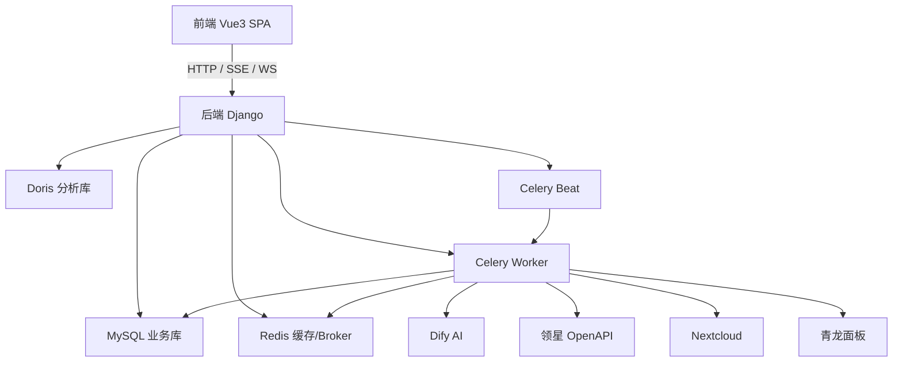

# 整体架构与技术栈

本文面向开发者，描述系统的整体架构、分层与关键设计决策。

## 架构总览

前后端分离的单体应用 + 异步任务层：

## 后端分层（`backend-master/`）

严格遵循「瘦 Controller / 胖 Service」与职责归类铁律：

| 层 | 目录 | 职责 |
| --- | --- | --- |
| 配置 | `backend_master/` | `settings.py` / `urls.py` / `celery.py` / `asgi.py` / `wsgi.py` / `analytics_database_router.py` |
| 视图 | `api_v1/views/`、`api_v2/views/` | HTTP 解析、出参包装，**禁**业务计算 |
| 序列化 | `api_v1/serializers/`、`api_v2/serializers/` | 字段映射、入参校验、DTO |
| 模型 | `api_v1/models/`、`api_v2/models/` | 表结构、关联、Manager，**禁**跨表业务计算 |
| 服务 | `api_v1/services/`、`api_v2/services/` | 业务计算、跨模型聚合、外部调用 |
| 异步任务 | `api_v1/tasks/`、`api_v2/tasks/` | Celery 任务，每个任务一个文件 |
| 鉴权 | `api_v1/auth/` | 认证后端类 |
| 权限 | `api_v1/permissions/`、`api_v2/permissions/` | DRF 权限类 |
| 中间件 | `api_v1/middleware/` | HTTP 中间件 |
| 工具 | `api_v1/utils/`、`api_v2/utils/` | 纯函数工具 |
| 管理命令 | `api_v1/management/commands/` | `python manage.py xxx` |

## 两个 Django App 的边界

- **`api_v1`**：业务 CRUD 接口（系统管理、销售、广告查看、统计、采集、NC、通知等）。
- **`api_v2`**：工作流任务调度与异步执行（广告执行、AI 对话、图片上传、标签同步等）。不承载 CRUD，鉴权与 `api_v1` 共享，可直接导入其 models / services。

## 技术栈版本

| 组件 | 版本 / 说明 |
| --- | --- |
| Django | 5.1 |
| DRF | 3.15 |
| Celery | 5.3+（redis broker） |
| 数据库 | MySQL（业务）+ Apache Doris（分析，只读） |
| 缓存 | Redis（django-redis） |
| OAuth2/OIDC | django-oauth-toolkit 3.x |
| 前端 | Vue 3.5 + Vite 7 + TypeScript 5.9 |
| UI | Element Plus 2.11 + UnoCSS |
| 状态 | Pinia 3 |
| 包管理 | pnpm（强制） |
| Node | `^20.19.0 \|\| >=22.12.0` |

## 关键设计决策

1. **数据出口最终成形**：枚举翻译、金额 / 日期 / 单位格式化、字段重命名、聚合统计全部在后端完成，前端拿到即可渲染。
2. **双数据库路由**：`AnalyticsDatabaseRouter` 把 `analytics` 库的 app 路由到 Doris，并阻止 Django 对 Doris 执行迁移。
3. **统一响应**：`{code, data, msg}`，成功 `code="00000"`；分页 `{total, list}`；异常走 `custom_exception_handler`。
4. **Celery 三队列**：`celery`（轻量）、`parallel_queue`（并发=4，AI 对话）、`single_thread_queue`（并发=1，写同资源 / 外部 API）。
5. **AI Plan Mode**：LLM 输出 `<plan>` JSON → `plan_translator` 归一化为标准 Schema → 前端 `PlanCard` 渲染，数据出口后端定型。
6. **双 ID 安全**：AI 会话 / 消息对外用 `public_id`（UUID），内部 int 主键不暴露给前端。
7. **仪表盘当前为 Mock**：首页仪表盘 8 个组件中仅 `DashboardHeader`（天气）接真实 API，其余 7 个（库存 / 实时广告 / 实时销量 / 补货 / 评论 / 结算利润 / 店铺绩效）均为硬编码 Mock 数据，尚未接入后端 API。
8. **亏损统计同步为 no-op**：`lossmakingorders_sync` 接口当前是空操作，不触发领星拉取；`MonthlyLossOrder` / `MonthlyLossOrderFirst20` 数据由外部注入（系统内无写入代码）。
9. **广告提交需手动触发**：`submit_pending_campaigns_task` 未被 Beat 调度，实际靠 HTTP `/api/v2/ads/submit/` 手动同步触发。
