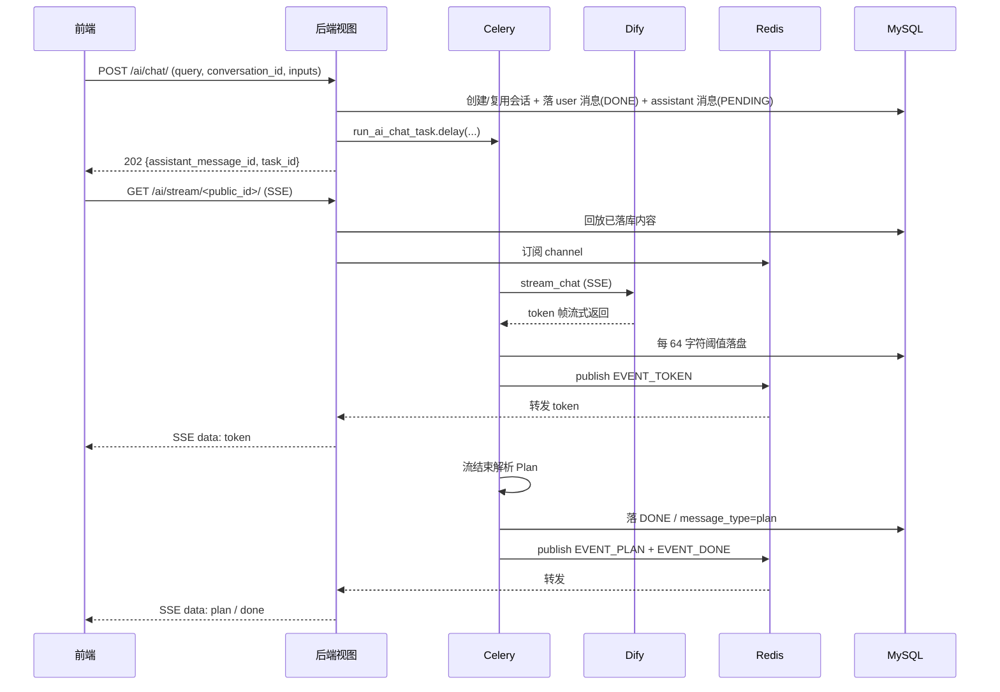

# AI 助手技术栈

本文面向开发者，详述 AI 助手的完整技术架构与数据流。

## 架构总览

## 后端组件

### 数据模型（`api_v2/models/`）

| 模型 | 说明 |
| --- | --- |
| `DifyApp` | Dify 应用配置表，`code` 唯一标识，`api_key_encrypted` 用 Fernet 加密存储，`mode`(chatflow/agent/workflow) 决定应用类型，`is_default` 标识系统默认应用，`Manager.get_default()` 按优先级取默认 |
| `AiConversation` | 会话表，双 ID（int 主键 + `public_id` UUID），`dify_conversation_id` 维系 Dify 上下文，`dify_app` 外键锁定会话所属应用（`on_delete=PROTECT`），`group` 外键可空，`pinned_at` 置顶 |
| `AiMessage` | 消息表，`role`(user/assistant)、`message_type`(text/plan)、`status`(pending/streaming/done/failed/cancelled)、`content`、`raw_plan_json`、`dify_message_id`、`task_id`、`error_msg` |
| `AiConversationGroup` | 用户自定义分组，`order` 排序，`(user, name)` 唯一 |
| `AiPlanExecution` | Plan 确认执行审计留痕 |

### 服务层（`api_v2/services/ai/`）

- **`AiChatService.start_chat`**：编排「复用/新建会话 → 落 user 消息(DONE) → 落 assistant 消息(PENDING) → `delay` 入队 → 回写 task_id」，事务外入队防 worker 读不到行。
- **`DifyClient.stream_chat`**：封装 Dify `/v1/chat-messages` SSE，Bearer 认证、SSE 帧解析、超时（连接 10s / 读 120s），返回 `DifyStreamChunk` 生成器。实例化时按传入的 `DifyApp` 解析凭据（`app.resolve_api_base()` + `app.decrypt_api_key()`），无参时回退 `DifyApp.objects.get_default()`。
- **`PlanTranslator`**：从累积回答正则提取 `<plan>{...}</plan>` JSON，翻译为前端标准 Schema（`plan_id/title/description/options/multi_select/allow_custom/custom_field/confirm_action/cancellable`），补默认值、统一 snake_case。这是「数据出口最终成形」的执行者。
- **`AiGroupService`**：分组 CRUD、移动会话、重排序，强制 `user` 过滤防越权。

### Celery 任务（`api_v2/tasks/ai_chat_task.py`）

`run_ai_chat_task`（`parallel_queue`，`soft_time_limit=840` / `time_limit=900`）：

1. 起手置消息 `STREAMING` + 广播 `EVENT_MESSAGE_META`。
2. 按 `dify_app_id` 查 `DifyApp` 实例化 `DifyClient`（为 None 时回退默认应用）。
3. 流式调 Dify，累积 token，每 64 字符阈值落一次库 + 广播 `EVENT_TOKEN`。
3. 流结束：落 `DONE`，解析 Plan 则置 `message_type=plan` + `raw_plan_json`，广播 `EVENT_PLAN` + `EVENT_DONE`。
4. 异常：置 `FAILED` + 保留已生成内容 + 广播 `EVENT_ERROR` + `EVENT_DONE`，再 re-raise。

浏览器关闭不影响任务持续运行。

### 视图层（`api_v2/views/`）

- **`ai_chat_view.py`**：`POST /ai/chat/` 提交问题（入参含 `app_code` 指定 Dify 应用）；会话列表 / 搜索 / 历史回放 / 重命名 / 置顶 / 删除 / 移动；取消生成（Celery revoke + 广播 done）。
- **`ai_app_view.py`**：`GET /ai/apps/` 返回 `is_active=True` 的 Dify 应用列表，按 `sort_order` 升序，仅暴露 `id/code/name/description/icon/mode/is_default/sort_order`，不含密钥。
- **`ai_stream_view.py`**：`GET /ai/stream/<uuid:public_id>/` SSE 订阅。WSGI 同步生成器 + `StreamingHttpResponse`，流程=回放 DB 已落内容 → 补播 plan → 终态直接 done → 否则订阅 Redis Pub/Sub 阻塞转发，25s 心跳、600s 最长订阅、`X-Accel-Buffering: no`。
- **`ai_group_view.py`**：分组 CRUD + 重排序 + 移动会话。

### Redis 频道（`api_v2/utils/ai_redis_channel.py`）

事件类型：`EVENT_TOKEN`、`EVENT_PLAN`、`EVENT_DONE`、`EVENT_ERROR`、`EVENT_MESSAGE_META`。

## 前端组件

### 组件（`src/components/AiAssistant/`）

- **`ChatPanel.vue`**：右侧 1080px 抽屉主体，左侧栏（新建/搜索/分组/置顶/会话列表）+ 右侧消息流 + 输入区。输入区含「思考」chip 与「应用切换器」chip（`el-dropdown` 列出 `availableApps`，切换时弹确认开新会话）。
- **`MessageItem.vue`**：消息气泡，区分 user/assistant，解析 `Impl` 深度思考折叠块 + Markdown 渲染，Plan 消息渲染 `PlanCard`，流式指示器，失败提示，复制/重新生成。
- **`PlanCard.vue`**：完全由后端 Plan Schema 驱动，`multi_select` 决定 checkbox/radio，`allow_custom + custom_field` 渲染「其他」输入框，`cancellable` 控制取消按钮。
- **`ConversationItem.vue`**：会话条目，置顶图标 + 下拉菜单（置顶/重命名/导出/移到分组）。

### Composable（`src/composables/aiAssistant/`）

- **`useAiChatStream.ts`**：fetch + ReadableStream 实现 SSE（不用 EventSource，因需自定义 Authorization 头），手动解析 `event:`/`data:` 帧，按类型分发回调，暴露 `abort()`。
- **`useExportConversation.ts`**：纯前端导出会话为 Markdown（`<标题>_<日期>.md`，Plan 渲染为 JSON 代码块，Blob 下载）。
- **`useKeyboardShortcuts.ts`**：全局快捷键（仅抽屉打开时生效）：`Ctrl/Cmd+K` 搜索、`Ctrl/Cmd+/` 新建、`Esc` 关闭。
- **`useConversationGroups.ts`**：按「今天/昨天/7 天内/30 天内/更早」5 段分组 + 关键词过滤。

### Store（`src/store/modules/ai-assistant-store.ts`）

Pinia store，`panelOpen` / `activeConversationId` / `activeAppCode` 用 `useStorage` 持久化（消息正文不入 localStorage 防敏感数据明文落盘），`availableApps` 缓存后端应用列表，`currentApp` computed 按优先级匹配（activeAppCode → is_default → 首条），会话/分组列表缓存，`sending` 锁防重复点击。

### API（`src/api/aiAssistant/aiChat.ts`）

REST 封装（startChat / listConversations / listMessages / delete / rename / pin / cancel / move / search + groups CRUD / reorder + `listAiApps` 拉取应用列表），走 `requestV2`；SSE 由 composable 直接 fetch。`startChat` 入参含 `app_code` 指定目标 Dify 应用。

## Dify 工作流

- 思考模式双模型分流：`thinking_mode` 变量（on/off）→ `deepseek-reasoner`(R1，带 `Impl` 标签) / `deepseek-chat`(V3 快答)。
- Plan Mode：LLM 提示词约束输出 `<plan>{...}</plan>` JSON，`plan_translator.py` 自动提取归一化。
- **多应用路由**：每个 `DifyApp` 记录携带独立的 `api_base` + Fernet 加密的 `api_key`，`DifyClient` 实例化时按 app 解析凭据。`AiConversation.dify_app` FK 锁定会话所属应用，新建会话时由前端 `app_code` 决定，续接会话时忽略前端值（Dify `conversation_id` 不可跨应用复用）。
- 配置：`DIFY_API_BASE` + `DIFY_API_KEY`（`.env`）作为无 `DifyApp` 时的兜底默认值；正式多应用走 `DifyApp` 表管理，**仅后端读取**，前端出现 sk- 即严重违规。

## 安全设计

- 对外一律 `public_id` UUID，内部 int 主键不暴露。
- 消息正文不落 localStorage。
- `DIFY_API_KEY` 仅后端持有。
- 会话/消息查询强制 `user` 过滤防越权。
